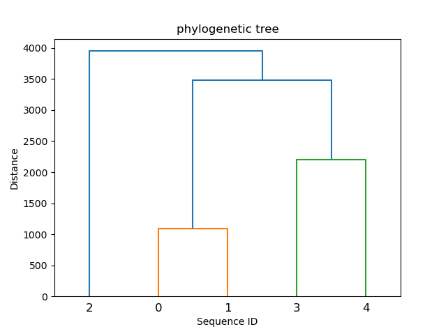

# clustal
Short project whose aim is to reprogram the clustal software

This script allows you to display a phylogenetic tree in order to make a multiple alignment.
Unfortunately, it does not allow multiple alignment, it only displays the tree
## How to download my conda environment


To download the conda environment from the environment.yml file you can use the following command:


```{}
conda env create -f environment.yml
```
## First step 

To start, you need to create a fasta file containing the different sequences you want to compare.
These sequences must be protein sequences.
To retrieve the sequences to compare, you can go to the uniprot website
URL : https://www.uniprot.org/

## second step
The script uses the following parameters : 

- --gap  This parameter corresponds to the gap penalty. By default it is -5.
- --file_name The name of your file containing the sequences

### Example

The sequences.fasta file is present in the github directory
You can run the script with the following command : 
```{R}
 python clustal_project.py --file_name sequences.fasta --gap -2
```

## Results

The script will open a window containing the phylogenetic tree.
If you execute the command line shown above as an example you should obtain the following tree




The sequence ids represent your sequences in the order they are in the file.
You must add +1 to the id to find your sequence.
That is to say that id 0 corresponds to sequence 1 in the file, id 1 to the second sequence and so on
